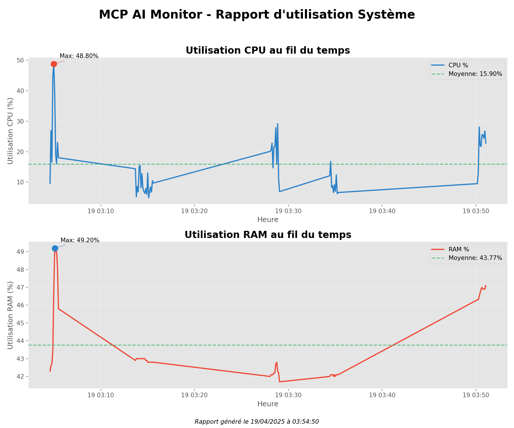

# MCP_AI_Monitor

<div align="center">
  


</div>

<div align="center">
  <h3>Système de surveillance système avancé avec détection d'anomalies par Intelligence Artificielle</h3>
</div>

## 🔍 Vue d'ensemble

MCP_AI_Monitor est une solution complète de surveillance système qui utilise des algorithmes d'apprentissage automatique non supervisés pour détecter des comportements anormaux dans l'utilisation des ressources. Conçu pour offrir une visibilité approfondie sur les performances de votre système en temps réel, il combine collecte de données, analyse prédictive et rapports détaillés.

<div align="center">
  
</div>

## ✨ Caractéristiques principales

- **🤖 Détection d'anomalies par IA** - Utilise Isolation Forest pour identifier les comportements système inhabituels
- **📊 Analyse en temps réel** - Surveillance continue des métriques CPU, RAM et réseau
- **🧠 Apprentissage adaptatif** - S'ajuste au comportement normal de votre système pour réduire les faux positifs
- **📱 Notifications instantanées** - Alertes système en cas d'anomalies détectées
- **📈 Visualisations détaillées** - Graphiques d'utilisation des ressources avec identification des tendances
- **⚙️ Analyse des processus** - Identification des applications gourmandes en ressources
- **🌐 Surveillance réseau** - Analyse des connexions actives et des performances réseau
- **📡 Intégration Discord** - Rapports détaillés automatiquement envoyés sur vos canaux Discord
- **🎨 Interface CLI moderne** - Affichage coloré et intuitif dans le terminal

## 🚀 Commandes disponibles

| Commande | Description |
|----------|-------------|
| `python mcp.py collect` | Collecte des données système (CPU, RAM) |
| `python mcp.py train` | Entraîne le modèle d'IA pour la détection d'anomalies |
| `python mcp.py monitor` | Lance la surveillance en temps réel avec détection d'anomalies |
| `python mcp.py stats` | Génère des graphiques et statistiques d'utilisation |
| `python mcp.py discord` | Envoie des rapports détaillés sur Discord |
| `python mcp.py network` | Analyse le réseau et envoie un rapport dédié |
| `python mcp.py all` | Exécute la séquence complète (collecte, entraînement, surveillance) |

## 🛠️ Architecture

MCP_AI_Monitor est composé de plusieurs modules complémentaires :

1. **Module de collecte de données** (`collect_data.py`)
   - Enregistre les métriques système à intervalles réguliers
   - Stocke les données dans un format CSV pour analyse ultérieure

2. **Module d'entraînement IA** (`train_model.py`)
   - Prétraite les données collectées
   - Entraîne un modèle Isolation Forest pour la détection d'anomalies
   - Sauvegarde le modèle pour une utilisation en temps réel

3. **Module de surveillance** (`monitor_ai.py`)
   - Utilise le modèle entraîné pour détecter les anomalies en temps réel
   - Implémente une phase d'apprentissage pour s'adapter au comportement normal
   - Distingue les lancements d'applications des véritables anomalies

4. **Intégration Discord**
   - Envoie des rapports distincts pour le matériel et le réseau
   - Utilise des webhooks configurables pour chaque catégorie de données
   - Format visuel optimisé avec embeds thématiques

## 📊 Rapports Discord

MCP_AI_Monitor génère des rapports détaillés et les envoie sur Discord via des webhooks dédiés :

### Rapports matériel
- **Informations système** - Détails sur le CPU, RAM, OS
- **Graphiques d'utilisation** - Visualisation des tendances CPU/RAM
- **Processus actifs** - Liste des applications les plus gourmandes

### Rapports réseau
- **Activité réseau** - Débits montants/descendants, volumes de données
- **Interfaces réseau** - Détails sur les interfaces actives et leurs adresses IP
- **Connexions actives** - Suivi des connexions établies et des processus associés

## 📋 Prérequis

- Python 3.8+
- Dépendances Python (installables via `pip install -r requirements.txt`) :
  - psutil - Collecte de données système
  - scikit-learn - Algorithmes d'apprentissage automatique
  - pandas - Manipulation des données
  - matplotlib - Génération de graphiques
  - colorama - Affichage coloré dans le terminal
  - discord-webhook - Intégration avec Discord

## 🔧 Installation

1. Clonez ce dépôt :
```bash
git clone https://github.com/MedusaSH/MCP_AI_Monitor.git
cd MCP_AI_Monitor
```

2. Installez les dépendances :
```bash
pip install -r requirements.txt
```

3. Configurez vos webhooks Discord (optionnel) :
   - Modifiez les URLs des webhooks dans le fichier `mcp.py`
   - Possibilité d'utiliser des webhooks distincts pour les rapports matériel et réseau

## 📖 Guide d'utilisation

### Démarrage rapide

Pour une première utilisation complète :

```bash
# Collecte de données (60 secondes par défaut)
python mcp.py collect

# Entraînement du modèle IA
python mcp.py train

# Surveillance en temps réel
python mcp.py monitor
```

### Workflow automatisé

Pour exécuter l'ensemble du processus en une seule commande :

```bash
# Exécute la séquence complète et envoie un rapport sur Discord
python mcp.py all --duration 120 --report
```

## 🔍 Détection d'anomalies

Le système utilise un algorithme d'Isolation Forest pour détecter les comportements anormaux :

1. **Phase d'apprentissage** - Collecte des données pour établir une ligne de base
2. **Adaptation dynamique** - Ajustement des seuils en fonction du comportement normal
3. **Filtrage intelligent** - Détection des lancements d'applications pour réduire les faux positifs
4. **Scoring des anomalies** - Classification des événements par niveau d'anormalité

## 🌱 Contribution

Les contributions sont les bienvenues ! Pour contribuer :

1. Forkez le projet
2. Créez une branche pour votre fonctionnalité (`git checkout -b feature/amazing-feature`)
3. Committez vos changements (`git commit -m 'Add some amazing feature'`)
4. Poussez vers la branche (`git push origin feature/amazing-feature`)
5. Ouvrez une Pull Request

## 📜 Licence

Ce projet est sous licence MIT. Voir le fichier `LICENSE` pour plus d'informations.

## 👥 Auteurs

- **MedusaSH** - *Développement initial* - [VotreGitHub](https://github.com/MedusaSH)

## 🙏 Remerciements

- Isolation Forest par scikit-learn
- psutil pour l'accès aux métriques système
- Bibliothèque discord-webhook pour l'intégration Discord

---

<div align="center">
  <p>Développé avec ❤️ et Passion</p>
  <p>© 2025 MCP_AI_Monitor. Tous droits réservés.</p>
</div> 
